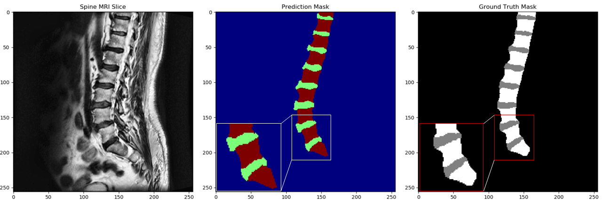

# Vertebrae and Spine Segmentation
PyTorch code: Spine and Vertebrae Segmentation 

**Dataset:** The “images” folder contains 20 pngs of spine MRI slices. The “masks” folder contains 20 .npy files, where each mask represents the segmentation map of the discs and vertebrae for the corresponding spine image (1.png goes with 1.npy, etc.). 

* Label 1: disc location
* Label 2: Vertebrae
* Label 0: Background

## What we’re looking for:
- [x] A data loader capable of reading in the provided dataset in batches
- [x] A script or instructions demonstrating using the data loader to run through 1 epoch of model training with a segmentation network
- [x] Well-organized, easily-understandable, and documented code
- [x] Object oriented programming where appropriate

### Additionally, please answer the following questions about your code:

* __What, if anything, did you do to verify that the segmentation masks and images were correctly aligned in the data loader?__
  * You could easily check the image dimention after ploting the first set of images to verify if they are aligned or not. Normally, I always check the following with the data loader:
     * printing inbetween values to make sure the data is normalized well.
     * the values are in that specifice range or not.
     * the input shape is correct or not.
     * the lables changed to categorical format or not, since I use SoftMax for multi-class segmentation task.

* __What assumptions did you make about the data or model training during this process?__
  * Very straight forward, this task/challenge is very similar to what we are doing on the daily bases at the lab. This task was not that difficault, and I tried to incorporate different piece of codes that I wrote for medical data analysis including, data augmentation, noramlisation, preprocessing and training prodedures.

## Model output
In the following figure, you can see one test spine MR image that we randomly selected from the validation set to visually evaluate the quality of segmentation by the trained model.

## How to train the model:

_To train the model, please run the following command, you can change the parameters within the train.py file._

    python -u src\trainer.py -nc 3 -e 300
    
    ***You can update the following default training parameteres:***
    parser.add_argument("-unetlr", help="to set the learning rate for the unet", type=float, default=0.0001)
    parser.add_argument("-e", "--epochs", help="the number of epochs to train", type=int, default=300)
    parser.add_argument("-gn", "--gaussianNoise", help="whether to apply gaussian noise", action="store_true",
                        default=True)
    parser.add_argument("--n_samples", help="number of samples to train", type=int, default=100)
    parser.add_argument("-bs", "--batch_size", help="batch size of training", type=int, default=4)
    parser.add_argument("-nc", "--n_class", help="number of classes to segment", type=int, default=3)
    parser.add_argument("-nf", "--n_filter", help="number of initial filters for DR-UNET", type=int, default=32)
    parser.add_argument("-nb", "--n_block", help="number unet blocks", type=int, default=4)
    parser.add_argument("-pt", "--pretrained", help="whether to train from scratch or resume", action="store_true",
                        default=True)

## Tensorboard Log File

#### Pretrained weights can be download from here: [Trained DR-UNet Weights](https://bit.ly/2VvkP98 "Named link title")

* Please place in the __weight files (.pth)__ inside the __weights/Verterbra_disk.unet_lr_0.0001_32.gaussian_noise/__ to reproduce the results and resume the training. 

* Otherewise you can change the _-pt_ parameter to __False__ to not train the model from scratch. 

## How to test the model:
_To test the model please run the following command_

    python -u src\predict.py
The output will be something similar:

    Using TensorFlow backend.
    filters 32, n_block 4
    Verterbra_disk.unet_lr_0.0001_32.gaussian_noise
    (5, 3, 256, 256) (5, 3, 256, 256)
    The validation dice score: 0.913376534685773
    time elapsed for training (hh:mm:ss.ms) 0:00:04.292751
